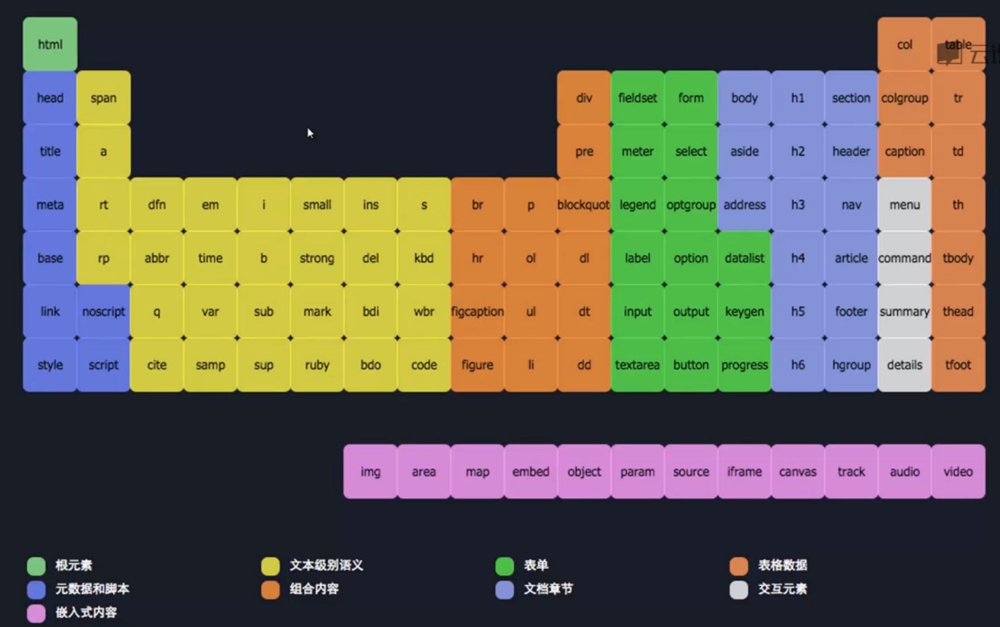

# DOCTYPE
- <!DOCTYPE>声明必须处于HTML文档的头部，在标签之前。告知浏览器的解析器用什么文档标准解析这个文档。DOCTYPE不存在或格式不正确会导致文档以兼容模式呈现。
- 标准模式的排版和JS运作模式都是以该浏览器支持的最高标准运行。在兼容模式中，页面以宽松的向后兼容的方式显示,模拟老式浏览器的行为以防止站点无法工作。
- DOCTYPE不存在或格式不正确会导致文档以标准模式呈现


## HTML5 为什么只需要写<!DOCTYPE html>?
- HTML5不基于 SGML(标准通用标记语言)，因此不需要对DTD(文档类型定义(Document Type Definition))进行引用，但是需要doctype来规范浏览器的行为（让浏览器按照它们应该的方式来运行）。
- 而HTML4.01基于SGML,所以需要对DTD进行引用，才能告知浏览器文档所使用的文档类型。

# head
## title

## meta
- charset 页面的字符编码 —— 最好写在title之前，否则title会乱码
- `<meta name="keywords" content="">`
- `<meta name="description" content="">`
- `<meta name="viewport" content="width=devive-width">`

```html
<meta charset="utf-8">
<meta http-equiv="X-UA-Compatible" content="IE=edge,chrome=1">
 ```

> <meta> 元素可提供有关页面的元信息（meta-information），比如针对搜索引擎和更新频度的描述和关键词。
><meta> 标签位于文档的头部，不包含任何内容。<meta> 标签的属性定义了与文档相关联的名称/值对。

>HTML 与 XHTML 之间的差异
在 HTML 中，<meta> 标签没有结束标签。
在 XHTML 中，<meta> 标签必须被正确地关闭。

content | some_text | 定义与 http-equiv 或 name 属性相关的元信息
---|---|---
http-equiv | content-type expires refresh set-cookie | 把 content 属性关联到 HTTP 头部
name | author description keywords generator revised others | 把 content 属性关联到一个名称
scheme | some_text | 定义用于翻译content属性值的格式

**注：**  
< meta http-equiv = "X-UA-Compatible" content = "IE=edge,chrome=1" />

这是个是**IE8的专用标记**,用来指定IE8浏览器去模拟某个特定版本的IE浏览器的渲染方式(比如人见人烦的IE6)，以此来**解决部分兼容问题**，例如模拟IE7的具体方式如下：

< meta http-equiv = "X-UA-Compatible" content = "IE=EmulateIE7" />

谷歌做了个外挂：Google Chrome Frame(谷歌内嵌浏览器框架GCF)。这个插件可以让用户的IE浏览器外不变，但用户在浏览网页时，实际上使用的是Google Chrome浏览器内核，而且支持IE6、7、8等多个版本的IE浏览器。

## link
- 可以引入 favicon.ico 网页的图标， 默认不用设置
- 样式文件

## style
- 样式内容

## script
- js代码内容

## html标签简介



# body
- 页面内容容器

# 块级元素

## address - 地址
## blockquote - 块引用
## center - 举中对齐块
## dir - 目录列表
## div - 常用块级容易，也是css layout的主要标签
## dl - 定义列表
## fieldset - form控制组
## form - 交互表单
## h1 - 大标题
## h2 - 副标题
## h3 - 3级标题
## h4 - 4级标题
## h5 - 5级标题
## h6 - 6级标题
## hr - 水平分隔线
## isindex - input prompt
## menu - 菜单列表
## noframes - frames可选内容，（对于不支持frame的浏览器显示此区块内容
## noscript - ）可选脚本内容（对于不支持script的浏览器显示此内容）
## ol - 排序表单
## p - 段落
## pre - 格式化文本
## table - 表格
## ul - 非排序列表

# 行内元素
## a - 锚点
- `<a href="#css">css</a>`
- `<a href="mailto:kuckboy@163.com">kuckboy</a>`
- `<a href="tel:1232379123">kuckboy</a>`
## abbr - 缩写
## acronym - 首字
## b - 粗体(不推荐)
## i - 斜体
## bdo - bidi override
## big - 大字体
## br - 换行
> &lt;br/&gt;

## cite - 引用
## q - 短引用
## code - 计算机代码(在引用源码的时候需要)
## dfn - 定义字段
## em - 斜体强调

## img - 图片
## input - 输入框
## kbd - 定义键盘文本
## label - 表格标签

## s - 中划线(不推荐)
## samp - 定义范例计算机代码
## select - 项目选择
## small - 小字体文本
## span - 常用内联容器，定义文本内区块
## strike - 中划线
## strong - 粗体强调
## sub - 下标
## sup - 上标
## textarea - 多行文本输入框
## tt - 电传文本
## u - 下划线
## var - 定义变量

## nav 导航栏
## footer 页脚
## canvas 图表和图像

# html相关的说明
## html语义化
- 所谓语义化就是通过每个标签知道其标签的功能。如<a>,<title>以及H5新增加的<heder>,<footer>,<nav>,<article>,<aside>等等。

## 为什么要语义化？
- 为了在没有CSS的情况下，页面也能呈现出很好地内容结构、代码结构。
- 用户体验：例如title、alt用于解释名词或解释图片信息、label标签的活用。
- 有利于SEO：和搜索引擎建立良好沟通，有助于爬虫抓取更多的有效信息：爬虫依赖于标签来确定上下文和各个关键字的权重。
- 方便其他设备解析（如屏幕阅读器、盲人阅读器、移动设备）以意义的方式来渲染网页
- 便于团队开发和维护，语义化更具可读性，遵循W3C标准的团队都遵循这个标准，可以减少差异化。

## HTML 编码
- GBK通常指GB2312编码，只支持简体中文字。
- utf通常指UTF-8，支持简体中文字、繁体中文字、英文、日文、韩文等语言（支持文字更广）
- 通常国内使用utf-8和gb2312，看自己需求选择

## Localstorage
Localstorage是**html5存储数据**的方式，在HTML5中，本地存储是一个window的属性，包括`localStorage`和`sessionStorage`。HTML5本地存储只能存字符串，任何格式存储的时候都会被自动转为字符串，所以读取的时候，需要自己进行类型的转换。是**永久性存储**，当然用户可以通过浏览器设置来删除。

## html页面的加载顺序
html文档加载是从上到下加载，只与标签的上下顺序有关，与标签选用无关。

## 标签属性
- title 鼠标放置在标签上方几秒内会显示title属性中的内容
