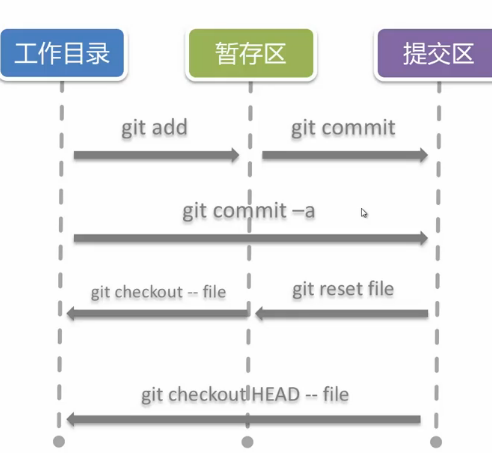
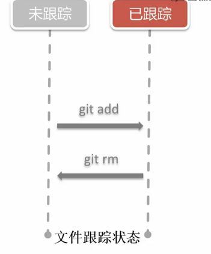

# git
- git 是一个免费开源的分布式版本控制系统(DVCS)
- git 是一个基于内容寻址的存储系统

## Git 简史
李纳斯·托沃兹 `linux之父 `当时为了维护linux，当时是使用分布式版本控制系统 `BitKeeper` 来管理和维护代码。2005年 `BitKeeper` 收回了免费使用的权限。李纳斯就准备自己做一个版本控制系统。没多久就开发出了现在流行于世的git的原型。

## 优势
- 快
- 完全的分布式
- 轻量级的分支操作
- Git已经成为现实意义上的标准
- 社区成熟活跃

## 安装
- window: `msysgit`
- Mac: `brew install git`
- Ubuntu: `apt-get install git`

## git config
- 用户配置
```
git config --global user.name "kuckboy1994"

git config --global user.email "shanchao@qq.com"
```
- 配置级别
	- `--local【默认，高优先级】：只影响本仓库` => ‘.git/config’ 文件位置
	- `--global【中优先级】：影响到所有当前用户的git仓库` => '~/.gitconfig' 文件位置
	- `--system【低优先级】：影响到全系统的git仓库` => '/etc/gitconfig'

## git init
初始化仓库

## git reflog
[link](http://www.jianshu.com/p/8b4c95677ee0)

## git status
- 未跟踪 < - > 跟踪
- 工作目录 < - > 暂存区
- 暂存区 < - > 最新提交

## git add
添加文件内容到`暂存区（同时文件被跟踪）`

## .gitignore
- 在添加时`忽略`匹配的文件
- 仅作用于`未追踪`的文件
- 说明
```
# Logs 注释
```

## git commit
暂存区提交到 提交区
```
git commit -m 'initial commit'
```
直接提交到 提交区
```
git commit -a -m 'initial commit'
```

## 从暂存区删除git-rm
- git rm --cached : 仅从暂存区删除
- git rm : 从暂存区于工作目录删除
- git rm $(git ls-files --deleted) : 删除所有被跟踪，但是在工作目录被删除的文件

## git log
输出简洁内容
```
git log --oneline
```
输出关系路径
```
git log --graph --pretty=format:'%Cred%h%Creset -%C(yellow)%d%Creset %s %Cgreen(%cr)%Creset' --abbrev-commit --date=relative
```

## git config alias.shortname <fullcommand>
```
git config --global alias.lg "log --graph --pretty=format:'%Cred%h%Creset -%C(yellow)%d%Creset %s %Cgreen(%cr)%Creset' --abbrev-commit --date=relative"
```
- 详细配置：[链接](http://ruby-china.org/topics/939)

## 配置的基本信息
这个目录下查看基本信息
```
~/.gitconfig
```

## git diff
- git diff
	- 工作目录与暂存区的差异
- git diff -cachedp[<reference>]
	- 暂存区与某次提交差异，默认为HEAD
- git diff <reference>
	- 工作目录与某次提交的差异

## git checkout --<file>
撤销本地修改

## git reset HEAD <file>
撤销暂存区内容。

将文件内容从上次提交复制到暂存区
```
git reset HEAD README.md
```


## git checkout HEAD -- <file>
撤销全部改动

将工作内容从上次提交复制到工作目录
```
git checkout HEAD -- README.md
```

## 总结



# 分支操作
## git branch
- git branch <branchName>
创建一个分支
```
git branch featrue-kuck
```
### git checkout
切换到`featrue-kuck`分支
```
git checkout featrue-kuck
```

创建一个分支 并切换到新创建的分支
```
git checkout -b <branchName>
```


- git branch -d <branchName>

- git branch -v


## github在线demo演示
1. `http://htmlpreview.github.io/?` + github上的文件地址。
2. 
	- 创建 `gh-pages` 分支。
	- `git checkout -b gh-pages` 创建 `gh-pages` 分支并切换到当前分支。
	- `git push origin master:gh-pages` 把本地 `master` 分支的内容推送到远程的 `gh-pages` 分支上。
	- 访问 `https://[用户名].github.io/[文件所在目录]`。如：`https://kuckboy1994.github.io/dailyNote/Layout/horizontally_1.html`


## git文档
[Pro Git（中文版）](http://git.oschina.net/progit/)


git存在暂存区和编辑区这两个概念
查一下文档再瞎说
## git的常见用法
1.git status
查看git上的状态

2.git add
 
在github上本地其实是由文件夹的，但是在github上如果文件夹是空的，在github上就不会显示的。


## 参考资料
- [个性化你的 Git Log 的输出格式—— Ruby China](http://ruby-china.org/topics/939)